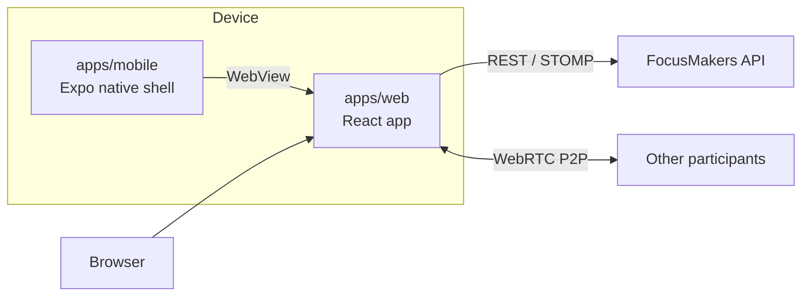

# FocusMakers

[한국어](./README.md) · English


## About

FocusMakers is a study timer service that uses AI Vision to recognize and analyze what the camera sees, then measures and records study time, including net study time. It aims to give exam takers an environment where they can stay immersed in studying.

> **Net study time (순공 시간)**
> Short for "pure study time" in Korean, it is the time spent focused on studying, excluding breaks and distractions. Source: [Namuwiki '순공'](https://namu.wiki/w/%EC%88%9C%EA%B3%B5)

## Structure

A monorepo managed with pnpm workspaces and Turborepo. The mobile app opens most of its screens in a WebView.

| Path                                                 | Role                                                                                    |
| ---------------------------------------------------- | --------------------------------------------------------------------------------------- |
| [`apps/web`](./apps/web)                             | Screens shown inside the WebView (React)                                                |
| [`apps/mobile`](./apps/mobile)                       | Stacks, navigation bar, camera permission, token handling, and more (Expo native shell) |
| [`packages/types`](./packages/types)                 | API and bridge message types                                                            |
| [`packages/design-tokens`](./packages/design-tokens) | Shared design tokens based on the design system                                         |
| [`packages/config`](./packages/config)               | ESLint and Prettier config                                                              |



> The full architecture, including the bridge, identity, and realtime connections, is in [docs/architecture.md](./docs/architecture.md).

## Tech stack

| Area             | Web `apps/web`                     | Mobile `apps/mobile`           |
| ---------------- | ---------------------------------- | ------------------------------ |
| Core             | React 19, Vite 7, TypeScript 6     | Expo SDK 57, React Native 0.86 |
| Routing          | React Router 7                     | Expo Router 57                 |
| Server state     | TanStack Query 5                   | -                              |
| Forms            | React Hook Form, Zod 4             | -                              |
| Realtime         | STOMP, WebRTC                      | -                              |
| Vision inference | MediaPipe Tasks Vision, Web Worker | -                              |
| WebView          | -                                  | react-native-webview 13        |
| Styling          | Tailwind CSS 4, shadcn/ui          | NativeWind 4                   |
| Testing          | Vitest 3                           | jest-expo                      |

## Getting started

You need Node 24 and pnpm 10.28.2. Running `corepack enable` makes pnpm use the version set in `packageManager` in the root `package.json`.

### Web

```bash
corepack enable
pnpm install
cp apps/web/.env.local.example apps/web/.env.local
pnpm --filter web dev
```

Set `DEV_API_PROXY_TARGET` in `apps/web/.env.local` to the development backend address you get from the team. Without it the dev server still starts, but `/api` and `/ws` requests fail with 503.

### Mobile

> [!WARNING]
> The app does not run in Expo Go. It includes `@react-native-firebase/*`, `react-native-fbsdk-next`, and `expo-dev-client`, so you need to build a Dev Client.

```bash
cp apps/mobile/.env.local.example apps/mobile/.env.local
pnpm --filter mobile ios
pnpm --filter mobile android
pnpm --filter mobile start
```

Run `ios` or `android`, whichever platform you need, to build and install the Dev Client. After that, `start` only launches Metro. See the environment variables section for the `.env.local` values.

- Testing on a physical device: see [docs/runbooks/device-web-dev-server.md](./docs/runbooks/device-web-dev-server.md)
- Detailed local build steps: see [docs/runbooks/local-dev-build.md](./docs/runbooks/local-dev-build.md)

## Scripts

Run these from the repository root. `dev`, `build`, `lint`, `typecheck`, and `test` use Turborepo to run the script of the same name in each package.

| Command                             | What it does                                                           |
| ----------------------------------- | ---------------------------------------------------------------------- |
| `pnpm dev`                          | Starts the dev server                                                  |
| `pnpm build`                        | Builds packages that have a `build` script, currently only the web app |
| `pnpm lint`                         | Lints everything                                                       |
| `pnpm typecheck`                    | Type checks everything                                                 |
| `pnpm test`                         | Runs all tests                                                         |
| `pnpm test:scripts`                 | Tests the Node scripts under `scripts/`                                |
| `pnpm format` / `pnpm format:check` | Applies or checks Prettier formatting                                  |
| `pnpm release:bump --web`           | Bumps the web version by CalVer, add `--app` to bump the app too       |

The mobile app has no `dev` script, so root `pnpm dev` only starts the web dev server and never the mobile app. Start the mobile app separately with `pnpm --filter mobile start`.

## Environment variables

Values come from the team and must never be pushed to the remote repository. Copy each app's `.env.local.example` to `.env.local`, then fill it in.

| Name                    | Location      | Required          | Purpose                                                         |
| ----------------------- | ------------- | ----------------- | --------------------------------------------------------------- |
| `DEV_API_PROXY_TARGET`  | `apps/web`    | For API access    | Development backend the dev server forwards `/api` and `/ws` to |
| `API_BASE_URL`          | `apps/mobile` | Yes               | Development backend API the app calls                           |
| `WEB_BASE_URL`          | `apps/mobile` | Yes               | Web address the app opens in the WebView                        |
| `GOOGLE_SERVICES_JSON`  | `apps/mobile` | For builds        | Path to the Android Firebase config file                        |
| `GOOGLE_SERVICES_PLIST` | `apps/mobile` | For builds        | Path to the iOS Firebase config file                            |
| `META_APP_ID`           | `apps/mobile` | Production builds | Meta ads SDK app ID                                             |
| `META_CLIENT_TOKEN`     | `apps/mobile` | Production builds | Meta ads SDK client token                                       |

- The Firebase config paths can stay empty when you only run Metro.
- Set both `META_APP_ID` and `META_CLIENT_TOKEN`, or leave both empty.
- `VITE_SENTRY_DSN`, `VITE_AMPLITUDE_API_KEY`, `VITE_GA4_MEASUREMENT_ID`, and `SENTRY_AUTH_TOKEN` are provided by the deploy environment.

## Deployment

| Target         | Method    | Trigger                                                                  | Destination                                                                           |
| -------------- | --------- | ------------------------------------------------------------------------ | ------------------------------------------------------------------------------------- |
| Web production | Vercel    | Merge to `main`                                                          | `web.focusmakers.app`                                                                 |
| Web dev        | Vercel    | `dev` branch                                                             | `web-dev.focusmakers.app`                                                             |
| App            | EAS Build | Profiles `development`, `development-simulator`, `staging`, `production` | `production` goes to the App Store and Google Play, the rest to internal distribution |

- Web and app versions follow CalVer `YY.WW.P`.
- The release PR bumps them with `pnpm release:bump --web`, adding `--app` in weeks when the app is also submitted.
- Release history and versioning rules are in [docs/releases.md](./docs/releases.md).

## Docs

| Document                                                                             | Contents                                                |
| ------------------------------------------------------------------------------------ | ------------------------------------------------------- |
| [`CLAUDE.md`](./CLAUDE.md)                                                           | Architecture boundaries, privacy principles, team rules |
| [`apps/web/CLAUDE.md`](./apps/web/CLAUDE.md)                                         | Web app structure, observability, native bridge rules   |
| [`apps/mobile/CLAUDE.md`](./apps/mobile/CLAUDE.md)                                   | Native shell rules, Firebase, screen orientation        |
| [`DESIGN.md`](./DESIGN.md)                                                           | Design system                                           |
| [`docs/architecture.md`](./docs/architecture.md)                                     | Overall structure, bridge, deployment, ADR index        |
| [`docs/domain-glossary.md`](./docs/domain-glossary.md)                               | Domain terms                                            |
| [`docs/screen-ownership.md`](./docs/screen-ownership.md)                             | Where each screen is implemented                        |
| [`docs/screens/`](./docs/screens)                                                    | Screen specs                                            |
| [`docs/adr/`](./docs/adr)                                                            | Architecture decision records                           |
| [`docs/runbooks/device-web-dev-server.md`](./docs/runbooks/device-web-dev-server.md) | Opening local web screens on a physical device          |
| [`docs/runbooks/local-dev-build.md`](./docs/runbooks/local-dev-build.md)             | Local Dev Client builds                                 |
| [`docs/runbooks/webview-debugging.md`](./docs/runbooks/webview-debugging.md)         | WebView debugging                                       |

## License

Copyright (c) 2026 breathless-youth. All rights reserved. No part of this repository may be used, copied, modified, merged, published, distributed, sublicensed, or sold without prior written permission from the copyright holder. See [LICENSE](./LICENSE) for the full text.
