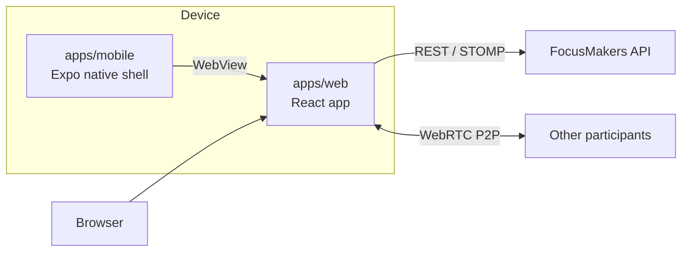

# FocusMakers

한국어 · [English](./README.en.md)


## 소개

포커스 메이커스는 AI Vision 기술을 활용하여 카메라 화면을 인식하고 분석해 순공 시간을 포함한 공부 시간을 측정하고 기록하는 공부 타이머 서비스다. 수험생들이 공부에 몰입할 수 있는 환경을 제공하는 것을 목표로 한다.

> **순공 시간**
> 순수 공부 시간의 줄임말로, 쉬거나 딴짓한 시간을 빼고 공부에만 집중한 시간을 말한다. 출처: [나무위키 '순공'](https://namu.wiki/w/%EC%88%9C%EA%B3%B5)

## 구조

pnpm workspaces와 Turborepo로 관리하는 모노레포다. 모바일 앱은 대부분의 화면을 WebView로 연다.

| 경로                                                 | 역할                                                           |
| ---------------------------------------------------- | -------------------------------------------------------------- |
| [`apps/web`](./apps/web)                             | WebView에 보이는 화면을 구현 (React)                           |
| [`apps/mobile`](./apps/mobile)                       | 스택·네비게이션 바·카메라 권한·토큰 관리 등 (Expo 네이티브 셸) |
| [`packages/types`](./packages/types)                 | API·브리지 메시지 타입                                         |
| [`packages/design-tokens`](./packages/design-tokens) | 디자인 시스템에 기반한 공용 디자인 토큰                        |
| [`packages/config`](./packages/config)               | ESLint·Prettier 설정                                           |



> 브리지, 신원, 실시간 연결을 포함한 전체 구조는 [docs/architecture.md](./docs/architecture.md)에 있다.

## 기술 스택

| 영역      | 웹 `apps/web`                      | 모바일 `apps/mobile`           |
| --------- | ---------------------------------- | ------------------------------ |
| 기반      | React 19, Vite 7, TypeScript 6     | Expo SDK 54, React Native 0.81 |
| 라우팅    | React Router 7                     | Expo Router 6                  |
| 서버 상태 | TanStack Query 5                   | -                              |
| 폼        | React Hook Form, Zod 4             | -                              |
| 실시간    | STOMP, WebRTC                      | -                              |
| 비전 추론 | MediaPipe Tasks Vision, Web Worker | -                              |
| 웹뷰      | -                                  | react-native-webview 13        |
| 스타일    | Tailwind CSS 4, shadcn/ui          | NativeWind 4                   |
| 테스트    | Vitest 3                           | jest-expo                      |

## 시작하기

Node 24와 pnpm 10.28.2가 필요하다. `corepack enable`을 실행하면 루트 `package.json`의 `packageManager`에 적힌 pnpm 버전을 쓴다.

### 웹

```bash
corepack enable
pnpm install
cp apps/web/.env.local.example apps/web/.env.local
pnpm --filter web dev
```

`apps/web/.env.local`의 `DEV_API_PROXY_TARGET`에는 팀에서 받은 개발 백엔드 주소를 넣는다. 이 값이 없으면 dev 서버는 뜨지만 `/api`·`/ws` 요청이 503으로 실패한다.

### 모바일

> [!WARNING]
> Expo Go로는 앱이 뜨지 않는다. `@react-native-firebase/*`, `react-native-fbsdk-next`, `expo-dev-client`가 포함돼 Dev Client를 빌드해야 한다.

```bash
cp apps/mobile/.env.local.example apps/mobile/.env.local
pnpm --filter mobile ios
pnpm --filter mobile android
pnpm --filter mobile start
```

`ios`나 `android` 중 필요한 쪽으로 Dev Client를 빌드해 설치한다. 그다음부터는 `start`로 Metro만 띄운다. `.env.local`에 넣을 값은 아래 환경 변수 절을 따른다.

- 실기기 검증: [docs/runbooks/device-web-dev-server.md](./docs/runbooks/device-web-dev-server.md) 참고
- 로컬 빌드의 상세 절차: [docs/runbooks/local-dev-build.md](./docs/runbooks/local-dev-build.md) 참고

## 스크립트

루트에서 실행하는 스크립트다. `dev`, `build`, `lint`, `typecheck`, `test`는 Turborepo가 각 패키지의 같은 이름 스크립트를 실행한다.

| 명령                                | 하는 일                                                  |
| ----------------------------------- | -------------------------------------------------------- |
| `pnpm dev`                          | dev 서버 실행                                            |
| `pnpm build`                        | `build` 스크립트가 있는 패키지 빌드, 지금은 웹만 해당    |
| `pnpm lint`                         | 전체 lint                                                |
| `pnpm typecheck`                    | 전체 타입 검사                                           |
| `pnpm test`                         | 전체 테스트                                              |
| `pnpm test:scripts`                 | `scripts/` 아래 Node 스크립트 테스트                     |
| `pnpm format` / `pnpm format:check` | Prettier 포맷 적용과 검사                                |
| `pnpm release:bump --web`           | 웹 버전을 CalVer 규칙으로 올림, 앱도 올리면 `--app` 추가 |

모바일에는 `dev` 스크립트가 없어서 루트 `pnpm dev`는 웹 dev 서버만 띄우고 모바일은 띄우지 않는다. 모바일은 `pnpm --filter mobile start`로 따로 띄운다.

## 환경 변수

값은 팀에서 받고 원격 저장소에 절대 반영하지 않는다. 각 앱의 `.env.local.example`을 `.env.local`로 복사한 후 채운다.

| 이름                    | 위치          | 필수            | 용도                                                 |
| ----------------------- | ------------- | --------------- | ---------------------------------------------------- |
| `DEV_API_PROXY_TARGET`  | `apps/web`    | API 연동 시     | dev 서버가 `/api`·`/ws` 요청을 넘길 개발 백엔드 주소 |
| `API_BASE_URL`          | `apps/mobile` | 필수            | 앱이 호출할 개발 백엔드 API 주소                     |
| `WEB_BASE_URL`          | `apps/mobile` | 필수            | 앱이 웹뷰로 열 웹 주소                               |
| `GOOGLE_SERVICES_JSON`  | `apps/mobile` | 빌드할 때       | Android Firebase 설정 파일 경로                      |
| `GOOGLE_SERVICES_PLIST` | `apps/mobile` | 빌드할 때       | iOS Firebase 설정 파일 경로                          |
| `META_APP_ID`           | `apps/mobile` | production 빌드 | Meta 광고 SDK 앱 ID                                  |
| `META_CLIENT_TOKEN`     | `apps/mobile` | production 빌드 | Meta 광고 SDK 클라이언트 토큰                        |

- Firebase 설정 파일 경로는 Metro만 띄울 때는 비워도 된다.
- `META_APP_ID`와 `META_CLIENT_TOKEN`은 둘 다 비우거나 둘 다 채운다.
- `VITE_SENTRY_DSN`, `VITE_AMPLITUDE_API_KEY`, `VITE_GA4_MEASUREMENT_ID`, `SENTRY_AUTH_TOKEN`은 배포 환경이 넣는 키다.

## 배포

| 대상    | 방식      | 기준                                                                   | 배포처                                                   |
| ------- | --------- | ---------------------------------------------------------------------- | -------------------------------------------------------- |
| 웹 운영 | Vercel    | `main` 머지                                                            | `web.focusmakers.app`                                    |
| 웹 개발 | Vercel    | `dev` 브랜치                                                           | `web-dev.focusmakers.app`                                |
| 앱      | EAS Build | 프로필 `development`, `development-simulator`, `staging`, `production` | `production`은 App Store·Google Play, 나머지는 내부 배포 |

- 웹과 앱 버전은 CalVer `YY.WW.P`를 따른다.
- 릴리즈 PR에서 `pnpm release:bump --web`으로 올리고, 앱을 함께 제출하는 주에는 `--app`을 붙인다.
- 릴리즈 기록과 버전 규칙은 [docs/releases.md](./docs/releases.md)에 있다.

## 문서

| 문서                                                                                 | 내용                                        |
| ------------------------------------------------------------------------------------ | ------------------------------------------- |
| [`CLAUDE.md`](./CLAUDE.md)                                                           | 아키텍처 경계, 개인정보 원칙, 팀 작업 규칙  |
| [`apps/web/CLAUDE.md`](./apps/web/CLAUDE.md)                                         | 웹 앱 구조, 관측 도구, 네이티브 브리지 규칙 |
| [`apps/mobile/CLAUDE.md`](./apps/mobile/CLAUDE.md)                                   | 네이티브 셸 규칙, Firebase, 화면 방향       |
| [`DESIGN.md`](./DESIGN.md)                                                           | 디자인 시스템                               |
| [`docs/architecture.md`](./docs/architecture.md)                                     | 전체 구조, 브리지, 배포, ADR 색인           |
| [`docs/domain-glossary.md`](./docs/domain-glossary.md)                               | 도메인 용어                                 |
| [`docs/screen-ownership.md`](./docs/screen-ownership.md)                             | 화면별 구현 위치                            |
| [`docs/screens/`](./docs/screens)                                                    | 화면 스펙                                   |
| [`docs/adr/`](./docs/adr)                                                            | 설계 결정 기록                              |
| [`docs/runbooks/device-web-dev-server.md`](./docs/runbooks/device-web-dev-server.md) | 실기기에서 로컬 웹 화면 열기                |
| [`docs/runbooks/local-dev-build.md`](./docs/runbooks/local-dev-build.md)             | 로컬 Dev Client 빌드                        |
| [`docs/runbooks/webview-debugging.md`](./docs/runbooks/webview-debugging.md)         | 웹뷰 디버깅                                 |

## 라이선스

Copyright (c) 2026 breathless-youth. All rights reserved. 저작권자의 서면 허락 없이 이 저장소의 어떤 부분도 사용, 복제, 수정, 병합, 게시, 배포, 재라이선스, 판매할 수 없다. 전문은 [LICENSE](./LICENSE)에 있다.
