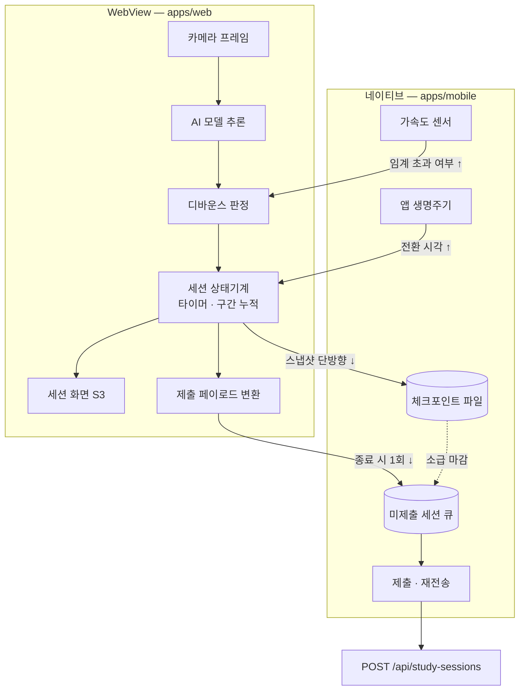

# 세션 상태 모델과 서버 계약 설계 (2026-07-26)

## 목표와 범위

온디바이스 AI가 판정한 공부 상태를 프론트엔드가 **어떻게 정의하고, 서버로 어떻게 전달하고, 서버에서 받은 값을 화면에 어떻게 쓰는지**를 확정한다.

근거는 두 가지뿐이다. 백엔드 Swagger 실계약(`http://52.78.219.53:8080/v3/api-docs`)과 ai-wiki의 확정 결정(`product/mvp-scope.md`, `product/policies.md`, `product/design.md`, `project/glossary.md`)이다. 둘 다에 없는 값은 이 문서에서 상수로 열어두고 "미확정"으로 표시한다.

이 문서가 정의하는 것은 상태 모델·판정 규칙·전송 규칙·복구 규칙과 그것을 담을 패키지 경계다. **화면 구현(S1~~S6, G1~~G5), 실제 Vision 모델 로딩·추론, 멀티룸은 범위 밖**이다.

## 1. 배치 — 상태기계는 웹, 저장·전송은 네이티브

세션이 도는 동안 상태·타이머·이벤트를 쥐고 있는 주체는 `apps/web`이다. `apps/mobile`은 원시 신호를 올려보내고, 결과를 받아 저장·마감·전송한다.



이 배치를 택한 이유는 세 가지다.

**판정은 한 곳에만 있어야 한다.** 웹과 네이티브가 각자 판정하면 브리지 지연·유실로 두 값이 갈라지고, 종료 시 어느 쪽을 보낼지 결정할 근거가 없어진다. 순공시간이 이 서비스의 핵심 값이므로 갈라짐을 허용할 수 없다.

**크래시 유실은 배치가 아니라 체크포인트가 막는다.** 크래시는 프로세스 전체를 죽이므로 네이티브 메모리의 타이머도 함께 사라진다. 살아남는 건 파일에 쓴 것뿐이다. 따라서 배치와 무관하게 체크포인트가 필요하고, 체크포인트가 있으면 배치를 바꿀 이유가 없어진다.

**`apps/web`은 독립 브라우저 서비스로도 배포한다**(ADR 0001). 상태기계를 네이티브에 두면 브라우저용을 하나 더 만들어야 하고, 두 구현이 같은 공부에 다른 순공시간을 낼 위험이 생긴다.

부수 효과로 브리지 트래픽이 최소가 된다. 매초 갱신되는 타이머는 상태기계와 같은 메모리에 있는 화면이 직접 읽으므로 브리지를 건너지 않는다.

## 2. 상태 모델

내부 도메인 타입과 서버 계약 타입(`StudyEventStatus`)을 **분리**한다.

```ts
/** 나열 순서 = 이벤트 변환 시 대표를 고르는 우선순위 (4절) */
export type DetectorKind = "away" | "device" | "phone";

export type SessionPhase =
  | { kind: "focus" }
  | { kind: "distracted"; reasons: DetectorKind[] }
  | { kind: "paused"; cause: "manual" | "background" };
```

분리하는 이유는 두 가지다.

첫째, **서버 enum이 화면에 필요한 구분을 담지 못한다.** 수동 일시정지와 화면 꺼짐은 서버에서 둘 다 `PAUSE`지만 화면에서는 다르다. 내부 타입이 서버 enum과 같으면 이 구분을 표현할 자리가 없다.

둘째, **눌러 담는 시점을 최대한 늦춘다.** 동시 감지를 `reasons`에 전부 유지하다가 서버로 나갈 때만 대표를 고른다. 화면은 여러 원인을 안 채로 문구를 고를 수 있고, 병합 정책이 바뀌어도 변환 함수 한 곳만 고치면 된다.

### 전이표

| 현재 상태              | 트리거                           | 다음 상태              |
| ---------------------- | -------------------------------- | ---------------------- |
| `focus`                | 감지기 `d` 판정 확정             | `distracted([d])`      |
| `distracted(R)`        | 감지기 `d` 추가 확정             | `distracted(R ∪ {d})`  |
| `distracted(R)`        | `d` 해제 확정, `R−{d}` 비지 않음 | `distracted(R − {d})`  |
| `distracted(R)`        | `d` 해제 확정, `R−{d}` 비었음    | `focus`                |
| `focus` · `distracted` | 일시정지 버튼                    | `paused("manual")`     |
| `focus` · `distracted` | 백그라운드·화면 꺼짐 진입        | `paused("background")` |
| `paused`               | 재개 버튼                        | `focus`                |
| `paused`               | 진입 후 N분 경과                 | 세션 자동 종료 (S3-8)  |
| 모든 상태              | 종료 확인 (S3-7)                 | 세션 수동 종료         |

세 가지를 덧붙인다.

**일시정지 진입 시 감지기를 정지하고 열린 비집중 구간을 닫는다.** 일시정지는 정책상 측정 중단이므로 감지를 계속할 이유가 없고(배터리에도 유리하다), 이렇게 해야 `PAUSE` 구간과 다른 이벤트가 겹치지 않아 서버 검증 `studySec ≤ 세션 길이 − PAUSE 합`이 구조적으로 보장된다.

**포그라운드 복귀는 상태를 바꾸지 않는다.** 복귀 재개는 수동으로 확정했다(2026-07-26). 돌아와도 `paused("background")`를 유지한 채 일시정지 화면(S3-3)을 보여주고, 사용자가 재개를 눌러야 `focus`로 간다. 자동 종료 카운트는 복귀 여부와 무관하게 일시정지 진입 시각부터 잰다.

**세션 시작 직후 상태는 `focus`다.** 카메라가 아직 사람을 못 잡았어도 판정 유지시간(1.5초) 안에 있으므로 자연스럽게 처리된다.

### 수동 타이머 모드

카메라 권한을 거부하면 수동 타이머 모드로 전환한다(2026-07-26 확정, 스토어 심사 대응 — `ai-wiki/product/app-review-checklist.md`). 이 모드에서는 **감지기가 하나도 돌지 않으므로 `distracted` 상태에 진입할 수 없다.** 상태 모델이 `focus`와 `paused` 둘로 줄어들 뿐 별도 타입을 만들지 않는다.

따라서 이벤트는 `PAUSE`만 생기고, 순공시간이 총 공부 시간과 같아진다(집중률 100%). 5절의 타이머 산출식은 `distractedMs`가 0이 될 뿐 그대로 성립하고, 6절 체크포인트와 7절 제출·재전송도 수정 없이 동작한다. **서버 계약도 동일하다** — 별도 API나 모드 플래그를 두지 않는다.

이 모드의 화면과 진입·전환 UX(설정 > 측정 방식)는 이 문서의 범위 밖이며 화면 스펙에서 다룬다.

## 3. 감지 → 상태 판정

세 감지기가 병렬로 돌고, 각각 순간 오탐을 거르는 유지시간을 갖는다. **값은 하드코딩하지 않고 상수 모듈로 분리한다** — M1 테스트에서 튜닝된다.

| 감지기              | 수단                                          | 확정 유지시간 | 해제 유지시간 |
| ------------------- | --------------------------------------------- | ------------- | ------------- |
| `away` 자리 이탈    | 카메라 + EfficientDet-Lite0 (person 미검출)   | 1.5초         | 2초           |
| `phone` 휴대폰 사용 | 카메라 + EfficientDet-Lite0 (cell phone 검출) | 0.5초         | 1.5초         |
| `device` 기기 조작  | 가속도 센서 (네이티브)                        | 0.5초         | 2초           |

**저조도 등으로 모델이 사람을 못 잡는 경우는 `away`와 같은 경로로 처리한다.** 모델 출력이 실제 자리 이탈과 구분되지 않고(둘 다 person 미검출), 서버 enum에도 따로 넣을 자리가 없다. 화면 문구도 분기하지 않고 기존 추정형 문구를 그대로 쓴다. "측정할 수 없는 시간은 집중으로 인정하지 않는다"는 측정 대원칙과 일치한다.

이벤트 시각은 **판정이 확정된 순간**으로 찍는다. 원시 감지 시점으로 소급 보정하면 화면의 순공 타이머가 뒤로 감기는 게 보인다. 확정 시점 기준의 오차는 이탈 1회당 0.5~1초이고 항상 순공이 조금 적게 잡히는 방향이라, 부풀리지 않는다는 원칙에도 맞는다.

### 가속도 신호의 경계

네이티브는 임계값 초과 여부(boolean)까지만 만들어 올려보낸다. 원시 가속도 값을 초당 수십 개 브리지로 넘기지 않는다. 유지시간 디바운스(0.5초/2초)는 다른 두 감지기와 동일하게 웹에서 한다 — 판정 로직이 한 곳에 모여 있어야 한다는 원칙은 유지된다.

임계 가속도 값은 mvp-scope의 미확정 항목이다. 네이티브 쪽 상수로 열어둔다.

## 4. 상태 → 서버 이벤트 변환

서버는 이벤트가 서로 겹치는 것을 금지하는데, 감지기 3종은 병렬로 동작해 실제로 겹침이 상시 발생한다(폰을 들고 자리를 뜨는 경우 등). 다음 규칙으로 눌러 담는다.

**연속된 비집중 구간 하나를 이벤트 한 건으로 만든다.** 감지기가 하나라도 켜져 있던 동안이 한 구간이다. `status`는 그 구간 동안 `reasons`에 한 번이라도 들어왔던 감지기 중 우선순위가 가장 높은 것 하나로 정한다.

**우선순위는 `away` > `device` > `phone`다** (2026-07-26 확정). 자리에 없으면 나머지 판정은 관측 자체가 불확실하므로 `away`가 최상위다. `device`가 `phone`보다 앞서는 것은 가속도 센서 신호가 카메라 객체 인식보다 오탐이 적고, 기기가 흔들리는 동안에는 카메라 기반 판정을 신뢰하기 어렵기 때문이다.

예를 들어 "폰을 30초 보다가 그 폰을 들고 일어나 2분 뒤 돌아옴"은 `AWAY` 한 건(2분 30초)이 된다. 사용자가 체감하는 딴짓 횟수(한 번)와 일치한다. "폰을 보면서 촬영 중인 기기도 건드림"은 `DEVICE` 한 건이 된다.

**연속된 일시정지 구간은 `PAUSE` 한 건이다.** `cause`가 `manual`이든 `background`든 서버에는 동일하게 간다.

이 결정이 순공시간과 최장 집중을 바꾸지 않는다는 점이 중요하다. 두 값은 비집중 구간의 **합집합**으로만 결정되므로, 어떤 `status`를 붙이든 동일하다. 이 결정이 바꾸는 것은 유형별 통계가 읽히는 방식뿐이다. 그리고 `GET /api/stats`는 유형별 **건수만** 돌려주고 시간은 주지 않으므로, 유형별 통계는 횟수 기준이 될 수밖에 없다 — 그래서 횟수가 체감과 맞는 병합 방식을 택했다.

매핑은 `away → AWAY`, `phone → PHONE`, `device → DEVICE`, 모든 일시정지 → `PAUSE`다.

시각은 `toISOString()`으로 UTC ISO-8601(밀리초 포함)로 보낸다. 길이가 0ms인 구간은 이벤트로 만들지 않는다(전이 직후 되돌림 방어).

## 5. 타이머 산출

타이머를 별도로 굴리지 않고 **구간에서 파생**한다.

```
spanMs        = endedAt − startedAt
pausedMs      = Σ (일시정지 구간 길이)
distractedMs  = Σ (비집중 구간 길이)

studySec = floor((spanMs − pausedMs) / 1000)
focusSec = floor((spanMs − pausedMs − distractedMs) / 1000)
```

이렇게 하면 서버 검증 규칙이 계산 구조상 자동으로 만족된다. `studySec`은 정의상 세션 길이에서 `PAUSE`를 뺀 값과 같고, `focusSec`은 거기서 0 이상을 더 뺀 값이므로 `studySec` 이하다. 일시정지 구간과 비집중 구간이 겹치지 않으므로(3절) `focusSec`이 음수가 되지도 않는다. 별도 타이커를 두면 초 단위 드리프트로 이 부등식이 아슬아슬하게 깨질 수 있는데 그 위험이 없어진다.

화면에 표시하는 값도 같은 식을 매초 평가한다. 세션 중에 본 숫자와 최종 제출값이 정확히 일치한다.

## 6. 체크포인트와 소급 마감

### 체크포인트

웹이 네이티브로 **단방향으로** 스냅샷을 내려보낸다. 네이티브는 판정하지 않고 받아 적기만 한다.

```ts
export interface SessionCheckpoint {
  schemaVersion: 1;
  /** 로컬 큐 식별자 — 서버 중복 방지는 (userId, startedAt) 복합키가 담당한다 (11절) */
  sessionId: string;
  startedAtMs: number;
  /** 마지막으로 웹이 살아 있었음이 확인된 시각 */
  lastAliveAtMs: number;
  phase: SessionPhase;
  phaseStartedAtMs: number;
  closedIntervals: ClosedInterval[];
}

export interface ClosedInterval {
  status: StudyEventStatus;
  startedAtMs: number;
  endedAtMs: number;
}
```

`closedIntervals`에는 **대표 `status`가 이미 확정된 상태로** 담긴다. 구간이 닫히는 시점에는 그 구간에 어떤 감지기가 관여했는지 전부 알고 있으므로 4절의 우선순위 규칙을 그때 적용한다. 이렇게 해두면 네이티브의 마감이 도메인 지식 없이 기계적으로 끝난다.

내려보내는 시점은 **10초 주기, 상태 전이 시, 백그라운드 진입 직전** 세 가지다. 네이티브는 파일 하나를 덮어쓴다. 최대 손실은 마지막 스냅샷 이후 구간, 즉 10초다.

### 소급 마감

앱 실행 시 미마감 체크포인트가 있으면 네이티브가 처리한다. 여기서 네이티브가 하는 일은 **판정이 아니라 마감**이다 — 확정된 스냅샷에 종료 시각 하나를 더해 페이로드를 만드는 결정론적 계산이라 웹과 다른 결론이 나올 수 없다.

**대원칙: 종료 시각은 언제나 측정이 끊긴 시각이며, 앱을 다시 연 시각을 쓰지 않는다.** 비정상 종료 후 재전송할 때 복구 시점을 종료 시각으로 삼으면 측정하지 않은 구간이 공부 시간에 섞여 들어간다. "측정할 수 없는 시간은 집중으로 인정하지 않는다"는 대원칙에 정면으로 어긋나므로, 어떤 갈래에서도 현재 시각을 종료 시각으로 쓰지 않는다.

**`phase`가 `focus`나 `distracted`면(크래시) `lastAliveAtMs`를 종료 시각으로 마감한다.** 측정이 끊긴 시각이 곧 마지막 체크포인트 시각이다. 그 이후는 카메라가 꺼져 있었으므로 복원하지 않고 버린다. 사용자에게는 "저장되지 않은 기록을 저장했어요" 수준으로 알린다.

**`phase`가 `paused`이고 아직 N분이 안 지났으면 마감하지 않고 세션을 복원한다.** 사용자가 앱을 다시 연 것이므로 일시정지 화면으로 돌려보내고, 재개를 누르면 이어서 공부한다.

**`phase`가 `paused`이고 N분이 지났으면 `phaseStartedAtMs + N분`을 종료 시각으로 마감한다.** 이 경우도 위 대원칙을 따른다 — 다시 연 시각이 아니라 일시정지 진입 시각에 정책상 자동 종료 시한 N분을 더한 값이다. 일시정지 구간은 `PAUSE` 이벤트로 포함한다. `PAUSE`는 총 공부 타이머도 멈추므로 `studySec`에는 어차피 잡히지 않고, 결과·기록에 "일시정지 N회 · 시간"을 표시하기 위해 필요하다.

어느 경우든 열린 구간을 종료 시각으로 닫고, 5절 식으로 `studySec`·`focusSec`을 계산해 큐에 넣는다. 종료 시각은 항상 과거이므로 서버의 "미래 불가" 검증에 걸리지 않는다.

자동 종료 대기 시간 N은 **기본 20분, 설정 상수**로 둔다. mvp-scope가 튜닝 파라미터로 명시한 값이다.

## 7. 제출과 재전송

**재전송의 기준선은 "다음에 앱을 열었을 때"다.** iOS는 강제 종료된 앱을 다시 깨우지 않고, 백그라운드 실행도 OS 재량이라 시점을 보장할 수 없다. 백그라운드 전송(`expo-background-task`)은 도입하더라도 보너스로 취급하고, 앱 실행 시점의 재전송 경로가 정책이 약속한 "연결 시 자동 재전송"을 책임진다.

미제출 세션 큐는 **네이티브 파일**에 둔다. WebView 저장소에 두면 백그라운드 태스크가 읽을 수 없고(그 작업은 WebView를 띄우지 않는다) iOS가 정리해버릴 수도 있다.

전송 트리거는 세션 종료 직후와 앱 포그라운드 진입 시다. 실패해도 사용자에게 오류를 보여주지 않는다 — 오프라인은 정상 시나리오다. 다만 `400`은 재시도해도 통과하지 못하므로 큐에서 제거하고 로그만 남긴다(무한 재시도 방지).

응답이 유실돼 성공 여부를 모르는 경우에도 **그냥 재전송한다.** 11절에서 합의한 `(userId, startedAt)` 복합키 덕분에 서버가 기존 세션을 반환하므로 중복이 생기지 않는다. 큐에서 제거하는 조건은 "성공 응답을 받았을 때"로 단순하게 유지한다.

`userId`는 네이티브가 붙인다. 웹은 `Omit<StudySessionCreateRequest, "userId">`까지만 만들고, WebView 모드에서는 네이티브가, 브라우저 단독 모드에서는 웹이 자체 등록한 값을 채운다.

## 8. 서버 통계를 화면에 쓰는 규칙

### 결과 화면(S4)은 로컬 값으로 그린다

이유가 두 가지다. 서버는 자정을 넘는 세션을 날짜별로 쪼개 배열로 돌려주는데, 사용자에게는 한 번의 공부이므로 쪼갠 값을 보여주면 어색하다. 그리고 3색 타임라인은 이벤트 시각이 필요한데 `GET /api/stats`는 건수만 돌려준다. 로컬 값은 분할 전 원본이라 두 문제가 동시에 풀리고, 오프라인에서도 정상 동작한다.

### 홈·기록은 서버 값에 미전송분을 합산한다

서버 값만 쓰면 지하철에서 두 시간 공부한 사용자가 홈에서 오늘 순공시간 0을 보게 된다. 큐에 남은 세션을 더해서 보여준다.

| 값                                                 | 합산 방식                                                                    |
| -------------------------------------------------- | ---------------------------------------------------------------------------- |
| `totalStudySec` · `totalFocusSec` · `sessionCount` | 더한다                                                                       |
| `focusRate`                                        | 합계 기준으로 재계산 (`합계 focusSec ÷ 합계 studySec × 100`, 분모가 0이면 0) |
| `longestFocusSec`                                  | 서버 값과 로컬 최장 구간 중 큰 값                                            |
| `studiedDatesInMonth`                              | 로컬 세션 날짜를 합집합으로 추가                                             |
| 스트릭 (`GET /api/stats/streak`)                   | **합산하지 않고 서버 값을 그대로 쓴다**                                      |

미전송 세션의 날짜 귀속은 `startedAt`의 KST 날짜로 통째 처리한다. 서버의 자정 분할을 로컬에서 재현하지 않는다 — 미전송 상태로 자정을 넘는 경우는 드물고, 전송되면 서버 값으로 교정되기 때문이다. 이 한계는 의도된 것이다.

스트릭을 합산하지 않는 이유는 스트릭 API가 날짜 파라미터 없이 전체 이력에서 계산하는 구조라 로컬 값을 끼워 넣을 지점이 없기 때문이다. 전송 후 반영된다.

전송이 성공하면 큐에서 빠지므로 합산값이 자연스럽게 서버 값으로 수렴한다.

### 세션 중 서버 통신은 없다

서버가 세션을 실시간 추적하지 않는 구조이므로, 세션이 도는 동안 오가는 네트워크는 0이다. 오프라인에서 세션이 완전히 동작해야 한다는 정책과 일치한다.

## 9. 패키지 경계

**`@focuson/study-core`를 신설한다.** 순수 TypeScript 패키지로, 카메라·DOM·React Native·MediaPipe 어디에도 의존하지 않는다.

담는 것은 상태 타입(`SessionPhase`, `DetectorKind`), 상태기계와 전이 규칙, 디바운스 판정, 구간 → 서버 이벤트 변환, 타이머 산출, 체크포인트 타입과 소급 마감 계산, 홈·기록 합산 계산이다.

담지 않는 것은 카메라 접근, 모델 로딩·추론, 네트워크 호출, 저장소 접근, React 컴포넌트다.

`packages/types`는 지금처럼 **서버 계약 타입만** 유지한다. 내부 도메인 모델을 넣지 않는다. `study-core`가 `@focuson/types`를 참조해 변환 함수의 출력 타입으로 쓴다.

이 경계는 루트 CLAUDE.md의 아키텍처 원칙("Vision AI 구현과 세션 집계 로직을 분리", "공부시간 계산 코어는 순수 TS 패키지")과 일치한다. 기존 패키지들과 마찬가지로 `lint`/`typecheck`/`test` 스크립트를 모두 노출한다.

## 10. 브리지 메시지 계약

네이티브에서 웹으로 올라가는 것:

```ts
type ToWebMessage =
  | { type: "device-handling"; active: boolean; atMs: number }
  | { type: "app-state"; state: "active" | "background"; atMs: number }
  | { type: "restore-session"; payload: SessionCheckpoint };
```

`restore-session`은 6절의 복원 갈래에 필요하다. 네이티브가 미마감 체크포인트를 발견했고 아직 N분이 안 지났으면, 상태기계가 웹에 있으므로 스냅샷을 웹으로 돌려보내 세션을 이어가게 한다.

웹에서 네이티브로 내려가는 것:

```ts
type ToNativeMessage =
  | { type: "checkpoint"; payload: SessionCheckpoint }
  | {
      type: "session-complete";
      sessionId: string;
      payload: Omit<StudySessionCreateRequest, "userId">;
    };
```

매초 갱신되는 타이머 값과 상태 전환은 브리지를 건너지 않는다. 브라우저 단독 모드에서는 `ToWebMessage`가 오지 않으므로, `device` 감지기는 비활성으로 두고 `app-state`는 `visibilitychange`로 대체한다.

## 11. BE와 합의된 계약 변경 (2026-07-26)

FE 설계 중 Swagger 계약과 확정 정책 사이의 불일치 두 건을 발견했고, 둘 다 서버를 고치는 것으로 합의했다. **아래 두 항목은 서버 반영 전까지 FE가 기대하는 동작과 실제 동작이 다르므로, 구현 시 반영 여부를 확인해야 한다.**

**중복 제출 방지 — `(userId, startedAt)` 복합키.** 기존 `POST /api/study-sessions`에는 멱등키가 없어 같은 세션을 두 번 보내면 두 건으로 저장됐다. 제출은 성공했는데 응답이 유실되면 앱은 성공 여부를 알 수 없어, 재전송하면 중복되고 두지 않으면 유실되는 상황이었다. 오프라인 재전송을 하는 이상 반드시 마주치므로 FE만으로는 막을 수 없다. 합의된 동작은 **같은 `userId`와 `startedAt` 조합이면 새로 만들지 않고 기존 세션을 반환**하는 것이다.

> 확인이 필요한 예외 하나: 자정을 넘는 세션은 서버가 날짜별로 분할 저장하므로 한 번의 제출로 두 건이 생긴다. 이때 복합키 조회에는 첫 조각(원본 `startedAt`을 가진 쪽)만 걸린다. 재제출 시 **분할된 두 건을 모두 반환하는지** 확인해야 한다. 한 건만 돌아오면 FE는 정상 응답으로 판단해 큐에서 제거하는데, 이는 서버에 이미 두 건이 다 있으므로 결과적으로 문제없다 — 다만 결과 화면은 8절에 따라 로컬 값으로 그리므로 응답 개수에 의존하지 않는다는 점을 전제로 한다.

**스트릭 인정 기준 — 하루 순공시간 10분 이상.** 기존 Swagger는 "세션이 하루라도 있으면 그날은 공부한 날"로 계산해서 1분만 공부해도 스트릭이 이어졌다. `design.md`(2026-07-26 확정)의 홈 스트릭 정책인 "하루 순공시간 10분 이상"이 맞는 기준이며, **서버 계산을 이 기준으로 바꾸기로 합의했다.** FE가 자체 계산하려면 과거 날짜마다 `GET /api/stats`를 호출해야 해서 현실적이지 않으므로, 서버 값을 그대로 신뢰한다(8절에서 스트릭만 합산 대상에서 제외한 이유이기도 하다).

**(조건부, 아직 요청 안 함) 지난 세션의 타임라인.** 현재 `GET /api/stats`는 이벤트 건수만 주고 시각은 주지 않는다. V1.0 디자인상 기록 화면(S5)에 타임라인이 없으므로 지금은 문제가 없다. 지난 세션의 타임라인을 보여주기로 하면 그때 이벤트 시각 반환을 요청한다.

## 12. 이 문서가 확정하지 않은 것

mvp-scope의 미확정 항목 중 다음은 여전히 열려 있고, 상수로 노출한 채 M1 테스트에서 정한다.

- 프레임 처리 주기 (배터리 대 반응성)
- 가속도 "조작" 판정 임계값
- 일시정지 자동 종료 대기 시간 N (기본 20분으로 시작)
- 다중 인물 프레임(도서관·자습실) 처리 — vision 과제

## 13. 테스트

`study-core`는 순수 함수 모음이므로 단위 테스트로 전부 덮는다.

전이표의 모든 행을 검증한다. 특히 일시정지 진입 시 열린 비집중 구간이 닫히는지, 포그라운드 복귀가 상태를 바꾸지 않는지를 확인한다.

겹침 병합은 "폰을 보다가 그 폰을 들고 자리를 뜸" 시나리오로 `AWAY` 한 건이 나오는지 검증한다. 세 감지기가 모두 겹치는 경우, 겹침 없이 연달아 발생하는 경우도 함께 본다.

타이머 산출은 결과가 서버 검증 부등식을 항상 만족하는지 확인한다(`0 ≤ focusSec ≤ studySec ≤ 세션 길이 − PAUSE 합`). 무작위 구간 조합으로 성질 검사를 하면 좋다.

소급 마감은 세 갈래(N분 전 복원, N분 후 마감, 크래시 마감)를 각각 검증한다.

합산 계산은 서버 응답과 미전송 세션을 조합해 각 필드가 규칙대로 나오는지, 큐가 비면 서버 값과 정확히 같아지는지 확인한다.
