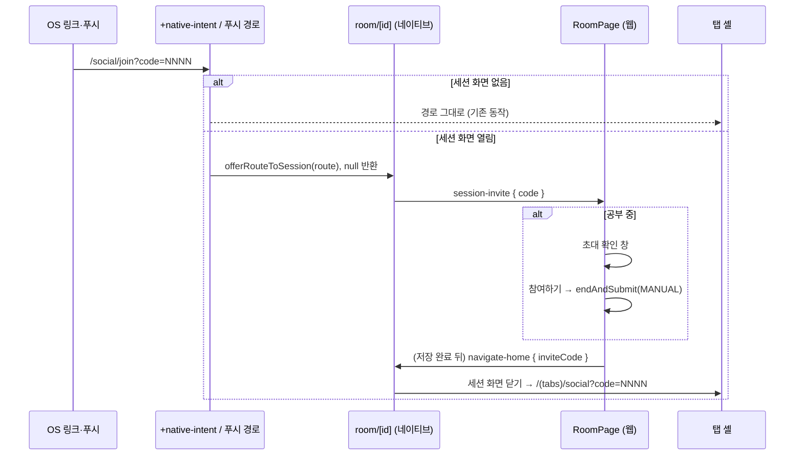

# BY-854 세션 중 초대 링크를 확인 창으로 받기

2026-10-03 승인. 공부 세션 중에 초대 링크로 앱에 돌아오면 초대코드 화면이 세션 위에 시트로 뜨는 문제의 설계다.

## 문제

- 세션 화면 `room/[id]`는 루트 Stack에 `fullScreenModal`로 떠 있다.
- 실행 중에 초대 링크가 오면 expo-router가 `social/join`을 루트 Stack 맨 위에 push하고, `social/join`의 `<Redirect>`가 그 자리를 새 `(tabs)` 인스턴스로 바꾼다.
- 결과 스택은 `(tabs)` → `room/[id]` → 두 번째 `(tabs)`다.
- native-stack의 `getModalRouteKeys`는 모달 뒤에 오는 화면 중 `presentation`이 없는 화면을 `modal`로 바꾸므로, iOS에서는 두 번째 `(tabs)`가 pageSheet로 아래에서 올라온다.
- 세션은 시트 밑에서 일시정지된 채 살아 있고, 시트에서 소셜룸에 참여하면 두 세션이 동시에 열릴 수 있다.
- 푸시 알림 탭(`router.push`)도 같은 방식으로 세션 위에 화면을 쌓는다.
- 세션 기록을 정상 저장하는 `endAndSubmit`은 웹만 시작할 수 있고, 지금은 네이티브가 웹에 세션을 끝내라고 요청하는 메시지가 없다.
- 직전 운영 앱 1.0.2(expo-router 6, native-stack 7.18.5)도 라우터와 modal 판정 코드가 같아서, 이번 배포에서 생긴 회귀인지는 확인되지 않았다.

## 해법

링크가 스택에 화면을 쌓기 전에 가로채고, 초대코드를 세션 웹뷰에 넘겨 웹이 확인 창을 띄운다. 기록 저장은 웹의 기존 종료 경로를 그대로 쓰고, 저장이 끝나면 네이티브가 세션 화면을 닫고 기존 소셜 탭을 초대코드 화면으로 바꾼다.

### 변경 1: 앱의 초대 창구 `lib/sessionInvite.ts`

- 세션 화면이 초대를 받을 핸들러 하나를 등록하는 모듈 스코프 통로다. 발신부(`+native-intent`, 푸시 경로)와 수신부(`room/[id]`)가 React 트리에서 조상과 자손이 아니어서 `sessionClosed.ts`와 같은 방식을 쓴다.
- 세션 화면은 `setSessionInviteHandler`로 핸들러를 등록하고, 반환된 함수로 해제한다.
- `offerRouteToSession(route)`는 경로가 `/social/join?code=NNNN`이고 등록된 핸들러가 있으면 초대를 넘기고 `true`를, 아니면 `false`를 돌려준다.
- 경로 문자열에서 4자리 초대코드를 꺼내는 함수와, 경로를 받아 초대면 창구에 넘기는 함수를 함께 둔다. 두 진입로가 같은 함수를 쓴다.
- 창구로 넘긴 경우에도 `invite_deep_link_opened { has_code: true }`를 남긴다. 가로채면 `social/join` 화면이 그려지지 않아 이 이벤트가 빠지기 때문이다.

### 변경 2: `app/+native-intent.ts`

- expo-router는 실행 중 들어온 링크를 `redirectSystemPath({ path, initial })`에 먼저 통과시키고, 반환값이 비어 있으면 화면 이동을 하지 않는다(`build/link/linking.js`의 `if (href) listener(href)`).
- `initial: true`(콜드 스타트)는 세션이 열려 있을 수 없으므로 그대로 반환한다.
- 실행 중 링크는 기존 `routeFromPushLink`로 앱 경로로 바꾸고, 창구가 초대를 받으면 `null`을 반환한다.
- 그 밖의 링크와 예외는 받은 경로를 그대로 반환해 기존 동작을 유지한다.

### 변경 3: 푸시 알림 경로 `app/_layout.tsx`

- `startPushMessaging`의 `navigate`가 `router.push` 전에 같은 창구를 거친다.
- 창구가 받으면 `router.push`를 하지 않는다.

### 변경 4: 세션 화면 `app/room/[id].tsx`

- 마운트될 때 창구에 핸들러를 등록하고 언마운트될 때 해제한다.
- 핸들러는 이미 잡아 둔 `replyRef`로 웹에 `session-invite`를 보낸다.
- `replyRef`가 비어 있으면 웹이 아직 로드되지 않아 시작된 공부가 없다는 뜻이므로, `navigate-home { inviteCode }`와 같은 처리로 세션 화면을 닫고 초대코드 화면을 연다.

### 변경 5: 브리지 메시지 `packages/types/src/bridge.ts`

- 네이티브에서 웹으로 가는 `{ type: "session-invite"; code: string; atMs: number }`를 추가한다.
- `NavigateHomeMessage`에 `inviteCode?: string`을 추가한다. `tab`과 함께 오면 초대가 우선한다.
- 모달 닫기와 초대 화면 열기를 한 메시지로 보내는 이유는 `tab`과 같다. 둘로 나누면 첫 메시지가 웹뷰를 언마운트하는 사이 둘째가 유실될 수 있다.
- 앱 파서(`webBridge.ts`)는 `inviteCode`가 4자리 숫자일 때만 살린다. 아니면 그 필드만 버리고 모달 닫기는 유지한다.
- 구 앱은 `inviteCode`를 모르는 파서라 필드를 버리고 홈으로 돌아갈 뿐 깨지지 않는다.

### 변경 6: 네이티브 `navigate-home` 처리 `lib/nativeBridgeHandler.ts`

- `inviteCode`가 있으면 모달을 닫고 `session-closed`를 알린 뒤 `router.navigate({ pathname: "/(tabs)/social", params: { code, at } })`로 이동한다.
- `at`은 매번 다른 값(`atMs`)이다. 소셜 탭은 `code`와 `at`을 key에 섞어서, 직전과 같은 코드가 다시 와도 초대코드 화면을 새로 연다.
- 이미 있는 `(tabs)`의 소셜 탭으로 가므로 `(tabs)`가 하나 더 쌓이지 않는다. 소셜 탭은 `code` 파라미터가 바뀌면 `RemoteScreen`을 다시 마운트해 초대코드 화면을 연다(`(tabs)/social.tsx`).

### 변경 7: 웹 파서와 초대 저장소

- `lib/bridge.ts`의 `parseToWebMessage`가 `session-invite`를 읽는다. `code`가 문자열이 아니면 버린다.
- `features/study-session/sessionInvite.ts`에 대기 중인 초대코드 하나를 담는 저장소와 `useSessionInvite()` 훅을 둔다. 새 초대가 오면 이전 코드를 덮어쓴다.
- 바깥 `RoomPage`가 구독을 잡고 있어서, 세션 복원 확인 중(수백 ms)에 온 초대도 잃지 않는다.

### 변경 8: 세션 화면 `routes/RoomPage.tsx`

- 공부 중이고 초대가 있으면 `SessionConfirmDialog`를 초대 문구로 띄운다.
- 초대 확인 창이 떠 있는 동안 종료 확인 창은 열지 않는다.
- `계속하기`는 초대를 지운다.
- `참여하기`는 기존 `endAndSubmit(MANUAL_END_REASON)`을 부른다.
- 초대가 남은 채 `done`이나 `unsaved`가 되면 결과 화면, 1분 미만 안내, 자동 종료 안내 대신 `navigate-home { inviteCode }`를 보낸다.
- `submitting`이면 저장이 끝날 때까지 기다리고, `error`면 기존 `다시 제출` 화면에 머문 뒤 성공하면 같은 규칙으로 넘어간다.
- `session-invite`는 네이티브만 보내므로 브라우저 단독 모드용 웹 라우팅 폴백은 두지 않는다.

### 변경 9: 결과 화면 `routes/ResultPage.tsx`

- 솔로 결과 화면에 있을 때 초대가 오면 바로 `navigate-home { inviteCode }`를 보낸다.
- 이 경로로 나갈 때는 결과 화면 설문 예약(`stageStudyResultExit`)을 하지 않는다.

## 확정한 결정

| #   | 결정                                                                                                                           | 이유                                                                                      |
| --- | ------------------------------------------------------------------------------------------------------------------------------ | ----------------------------------------------------------------------------------------- |
| 1   | 링크를 가로채고 웹 확인 창을 띄운다(네이티브 알림창이나 `social/join` 안 처리를 쓰지 않음)                                     | 시트가 생길 틈이 없고, 기록을 평소 경로로 저장하며, 세션 로직을 웹에 둔다는 원칙을 지킨다 |
| 2   | 문구는 제목 `진행 중인 공부를 종료하고 초대에 참여할까요?`, 본문은 기존 종료 확인 창의 저장 안내, 버튼 `계속하기` / `참여하기` | 문구 기준(voice-tone)의 안심 우선 원칙과 기존 종료 확인 창 틀을 따른다                    |
| 3   | 종료 뒤 결과 화면과 1분 미만 안내를 건너뛰고 바로 초대코드 화면으로 간다                                                       | 친구에게 합류하려는 의도에 맞고, 결과는 기록 탭에서 볼 수 있다                            |
| 4   | 세션이 이미 끝나 결과·안내 화면이 떠 있으면 확인 창 없이 초대코드 화면으로 간다                                                | 기록은 이미 저장됐다                                                                      |
| 5   | 저장 중이면 저장이 끝난 뒤 간다                                                                                                | 저장을 끊지 않는다                                                                        |
| 6   | 저장이 실패하면 `다시 제출` 화면에 머물고, 성공하면 간다                                                                       | 기록을 잃지 않는 쪽을 우선한다                                                            |
| 7   | 확인 창이 떠 있는데 초대가 또 오면 창은 두고 코드만 최신으로 바꾼다                                                            | 마지막에 누른 링크가 사용자 의도다                                                        |
| 8   | `계속하기`를 누르면 초대를 버린다                                                                                              | 다시 들어오려면 링크를 다시 누르면 된다                                                   |
| 9   | 20분 넘게 벗어났다 돌아와 자동 종료와 초대가 겹치면 자동 종료 안내를 건너뛴다                                                  | 4번과 같은 규칙이다                                                                       |
| 10  | 웹이 아직 로드되지 않았으면 네이티브가 세션 화면을 닫고 바로 초대코드 화면을 연다                                              | 시작된 공부가 없다                                                                        |
| 11  | 가로챈 링크도 `invite_deep_link_opened`를 남긴다                                                                               | 지표가 빠지지 않게 한다                                                                   |
| 12  | 초대로 결과 화면을 떠날 때는 설문을 예약하지 않는다                                                                            | 합류하러 가는 길에 설문이 끼어들지 않게 한다                                              |

## 배포 순서

- 새 브리지 메시지를 웹이 먼저 알아야 하므로 웹을 먼저 운영에 배포하고, 그 뒤 앱 빌드에 싣는다.
- 웹만 배포된 상태에서는 구 앱이 `session-invite`를 보내지 않아 기존 동작 그대로다.

## 테스트

- 앱(jest): 창구 등록·해제와 `offerRouteToSession`, 경로에서 초대코드 꺼내기, `redirectSystemPath`의 통과·가로채기, `navigate-home`의 `inviteCode` 파싱과 처리, 푸시 경로의 가로채기.
- 웹(vitest): `session-invite` 파싱, 초대 확인 창 표시·취소·확정, 저장 뒤 `navigate-home { inviteCode }`, 끝난 세션과 결과 화면에서의 즉시 이동.
- 실기기: iOS·Android Dev Client에서 세션 중 카톡 링크와 스킴 링크를 열어 녹화한다.

## 범위 밖

- 소셜룸 진행 중에 들어온 초대 링크(보던 화면을 버린다는 BY-582 결정 유지).
- 코드 없는 초대 링크(`/social/join`)는 가로채지 않는다.
- 세션 웹뷰가 한 번 메시지를 보낸 뒤 로드 실패 화면으로 바뀌었거나 렌더러가 다시 만들어지는 중이면, 초대가 웹에 닿지 않고 화면도 이동하지 않는다. 드문 경로라 알려진 한계로 두고, 사용자가 링크를 다시 누르면 된다.
- 세션이 없을 때 딥링크가 `(tabs)`를 하나 더 쌓는 기존 구조(BY-582부터)는 후속 후보로 남긴다.
- 초대가 아닌 푸시 알림이 세션 위에 탭을 쌓는 문제는 후속 티켓 후보다.
- 앱을 업데이트하지 않은 구 앱(1.0.3 이하)의 동작.

## 위키 반영 제안

- `.ai/product/specs/BY-404-룸-참여.md`의 "딥링크 없음(V1.3)"을 현재 동작으로 정정하고 세션 중 초대 정책을 추가한다.
- `.ai/product/voice-tone.md` 종료 절에 초대 확인 창 문구 행을 추가한다.
- 위키 PR은 별도 승인 뒤에 올린다.
